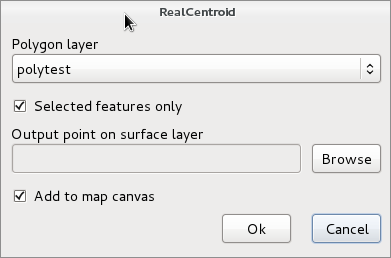
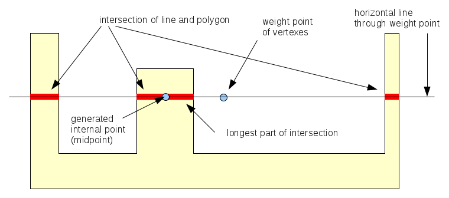

Real Centroids V1.0
===================

RealCentroids plugin creates a point shape file with internal points of a
polygon shape, similar to PostGIS (GEOS) ST\_PointOnSurface. The point will be
inside the polygon in all cases. Not only the points are created but the
attributes are also copied from the polygons to the internal points.
A single point is generated for multipart geometry. The internal pont will be
in the part with the largest area.

New features in this version
----------------------------

*   upgrade to QGIS 3.x
*	moved to vector menu

Installation
------------

Use the plugin manager or unzip the downloaded realcentroids.zip from the QGIS
plugin repository (http://plugins.qgis.org/plugins/realcentroid) into yours
plugins directory.

You can download the plugin from GitHub (https://github.com/zsiki/realcentroid), too.

Usage
-----

Enable the plugin in the *Plugins/Manage and Install Plugins ...*
dialog. Open the polygon layer you want to create centroids. Start the plugin
clicking on the icon in the plugins toolbar or select it from the plugins menu.
The following dialog appears

In the *Polygon layer*
list you can select one from the loaded polygon layers. If the active layer is
a polygon layer then it will be selected in the list. The
*Selected features only* is enabled if there are selected features in the
selected layer. Select a new shapefile for the output clicking on the
*Browse* button, . If you select an existing shapefile, you get a warning
weather to overwrite that shape. If you check *Add to map canvas* checkbox,
the point shape with the internal points is added to the current project. The
attributes of the polygons are also copied to the target point shape file. If
*Polygon layer* or *Output point on surface layer*
is empty, a warning will be displayed.

Why do we need such plugin? There is a *Polygon centroids*
option in the *Vector/Geometry Tools* menu.
This will create centroids at the weight point of the vertexes of the polygon.
So it can be outside the polygon in a concave or multipart case. Realcentroid
will place the point always inside the polygon. See figures below to compare
the results of the two methods. From QGIS 2.4 the GEOS pointOnSurface function
is available from Python/C++ API too, but the standard Polygon centroids tool
doesn't use it. My plugin uses pointOnSurface function for QGIS version 2.4 and
newer.

 created by Vector/Geometry Tools/Polygon centroids")

Algorithm used before QGIS 2.4
------------------------------

For each polygons the weight point is generated first. If the weight point is
outside, the intersection of the horizontal line through the weight point and
the polygon is generated. The midpoint of the longest line segment from thes
intersection result will be used. See the figure below.

For multipart polygons the algorithm is used for the largest part.

In QGIS 2.4 and after the pointOnSurface (GEOS) function is used.

Thanks to Seal Phone, Jukka Rahkonen, ozak and pxp44 (github) giving advices,
bug reports to improve the plugin.
